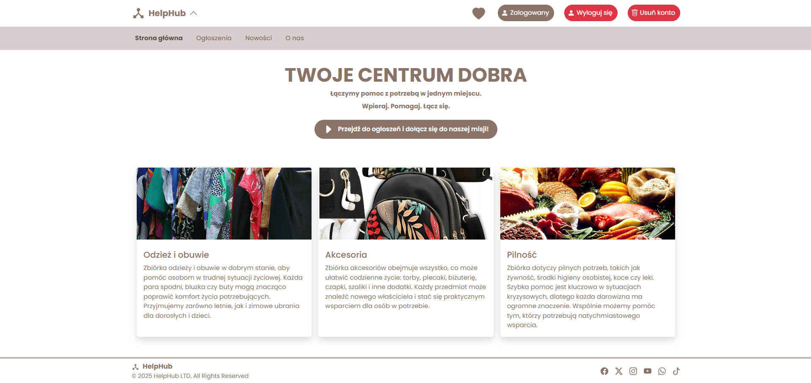
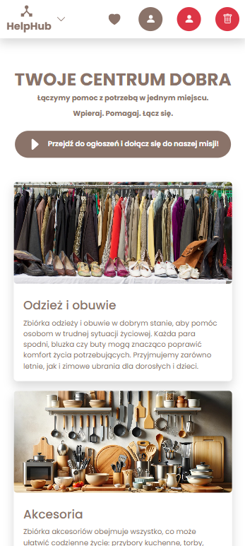
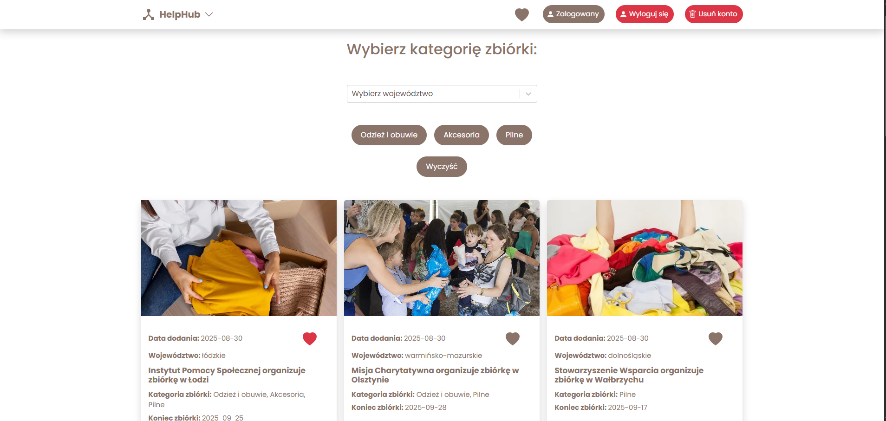
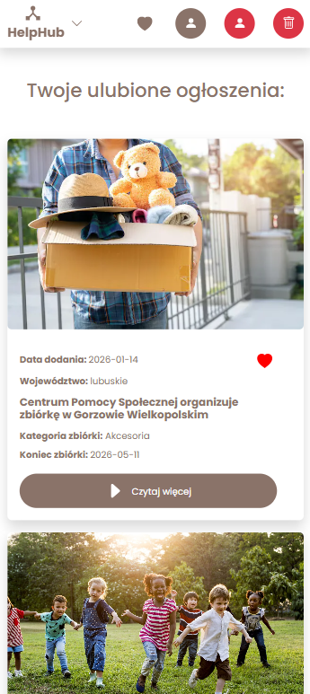

# 🛟 HelpHub

A central announcement app connecting users with aid organizations conducting collections of clothes, footwear,
accessories, food, hygiene products, blankets, and medicines in Poland. It solves the problem of the lack of
a
single place to browse and add collections by
various aid organizations.

**Available online at:**  
[https://help-hub-render.netlify.app/](https://help-hub-render.netlify.app/)

## 🚀 Features

- Browse announcements
- Filter announcements by selected categories
- Responsive interface
- Pagination of announcements pages
- User registration and login
- Adding/removing announcements from favorites
- React Router routing

## 📸 Screenshots

Below are example screenshots of the HelpHub app on desktop and mobile devices.

  
  

  
  

## 🛠️ Technologies

- Vite
- React
- Sass (using @import due to compatibility with Bootstrap)
- React Router
- REST API (powered by JSON Server for local development)
- Bootstrap
- React-Bootstrap
- React-Icons
- Responsive Web Design (Mobile First)
- Context API
- localStorage
- dotlottie-react
- React-Select

## 🔧 Local Installation

1. **Create a local folder named `help-hub` on your device**

   This will be the place to copy the repository.

2. **Clone the application into the created folder**

   Use the command `git clone` to download the repository:

   `git clone https://github.com/Your-Account/HelpHub.git`

3. **Navigate to the main folder in the terminal**

   Go to the project directory to be able to run npm commands:

   `cd HelpHub`

4. **Install the application**

   Install all required dependencies:

   `npm install`

5. **Configure environment variables**

   `.env` — file included in the repo with the default backend URL (e.g., production):

   `VITE_API_URL=https://help-hub-2sac.onrender.com`

   `.env.local` — local file (ignored by Git), where you can override the backend address for local testing:

   `VITE_API_URL=http://localhost:3020`

   If `.env.local` does not exist, the app uses the settings from `.env`

6. **Run the app in development mode**

   To run the app in dev mode, use:

   `npm run dev`

7. **Build the app for production (optional)**

   Prepare the app for deployment in production:

   `npm run build`

## 🖥️ Backend and Hosting

The backend for production is hosted on Render at:  
`https://help-hub-2sac.onrender.com`

**Note for reviewers:**  
The backend runs on Render's free plan, which may put the app to sleep after 15 minutes of inactivity.  
When the app is asleep, the first request might take a few seconds to respond.  
For local testing, using JSON server provides instant responses.

For local backend testing, JSON server is used — a REST API server based on the `db.json` file.

Local backend startup instructions:

- Install json-server globally:

  `npm install -g json-server`

- Or run without installation — ensure `db.json` is in the project root (where `package.json` is). Run json-server with:

  `npx json-server --watch db.json --port 3020`

**Note:** Port 3020is an example — you can choose any available port but remember to set it in `.env.local`.

- Configure `.env.local` (ignored by Git) so the app uses the local backend:

  `VITE_API_URL=http://localhost:3020`

Production backend runs on Render at:  
[https://help-hub-2sac.onrender.com](https://help-hub-2sac.onrender.com)

### 🆓 Render — free backend hosting

- Backend is hosted on Render’s free plan, which puts the app to sleep after 15 minutes of inactivity.
- To prevent sleeping and keep fast responses, Uptime Robot is used.
- Uptime Robot sends a GET request every 5 minutes to `https://help-hub-2sac.onrender.com` to keep the backend awake.

**Important:**  
In the free Render plan, data sent via POST, PUT, DELETE methods is not persistent — the backend works as a temporary
database, and after sleeping or restarting, changes may be lost. For persistent data storage, a dedicated database
server or a paid plan is needed.

## 🧾 Usage Instructions

➡️ For every user:

- Click the button on the homepage to go to public announcements,
- Use filters on the page to search collections by specific categories,
- To save collections to favorites you need to register and log in,
- After creating an account, you can save announcements to favorites.

➡️ For aid organizations (planned features):

- To publish announcements registration and login for organizations will be required,
- After creating an account, organizations can add announcements.

## 📊 App development possibilities with MoSCoW priority

✅ **Must Have**

- Filtering announcements
    - Voivodeship: filter announcements by region
    - Clothes and Shoes: filter by collections with clothes and footwear
    - Accessories: filter by collections with accessories
    - Urgent: filter by urgency (food, hygiene products, blankets, medicine)

- User registration and login
    - Ability to create an account
    - Login to existing account

- After login, user can manage favorite collections — add/remove collections to/from favorites

- Ability to browse announcements list with pagination

🌟 **Should Have**

- Favorite collections counter in the header, visible after login
- Registration and login for aid organizations
- Individual announcement adding by aid organizations

💡 **Could Have**

- Modal confirming addition of a collection to favorites by user
- Modal confirming announcement addition by organization
- Filtering announcements by additional categories

❌ **Won't Have**

- Payment form
- Language selection (Polish/English etc.)
- HelpHub_v2.0 version — app supporting animal collections and browsing adoption announcements across Poland